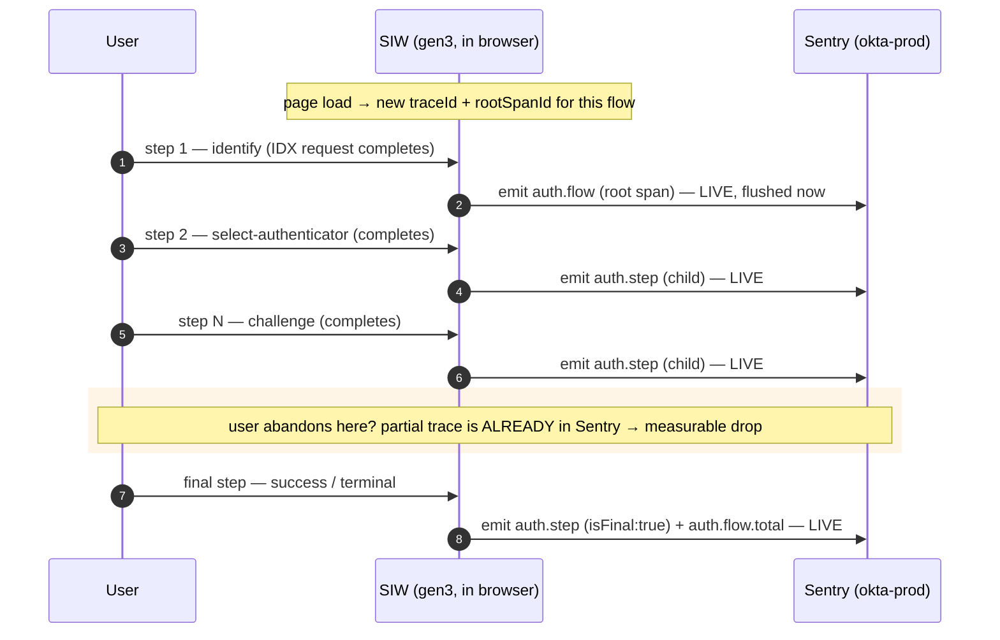
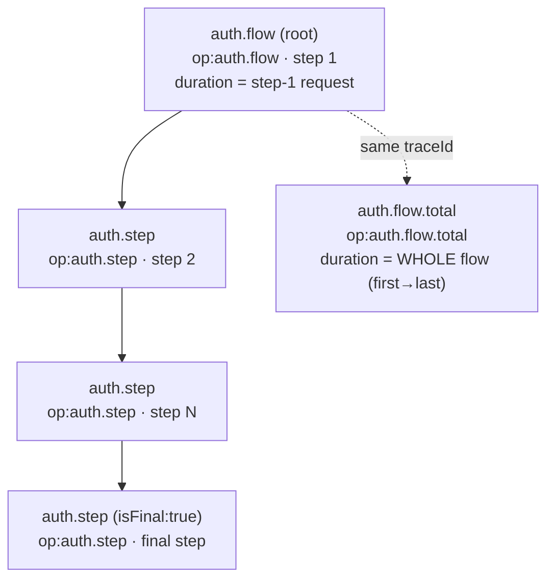

# Sentry for Observability — one-pager

Observability of SIW sign-in flows. (Error reporting is a separate, settled fit — out of scope
here.)

## 1. TL;DR

Sentry can answer the **simple** observability questions — counts, duration, authenticator mix
— across **all browsers** (data-scrubbing fixed in project settings; SDK v7 covers IE11). For
**funnels, exact counts, availability, long history, or joins** with other data, server-side
(Splunk / BigQuery) is stronger. Use Sentry for quick latency/mix checks and dashboards; lean
server-side for deep analytics.

## 2. What we can do with Sentry

The sweet spot is **simple aggregation of a numeric measure, sliced by a low-cardinality
dimension** — i.e. the authenticator. The widget emits one **transaction per step, live** as each
request completes — a root (`op:auth.flow`) for the first step and a child (`op:auth.step`) for each
later step, all sharing one `traceId` — plus searchable attributes (authenticator, flow, `isFinal`,
`outcome`, timings).

**Lead strength — latency per authenticator.** p50/p95/p99 of real request / end-to-end duration,
grouped by `factor`. This is genuine APM, live, exact-shape, and it's the thing server-side timings
can't give you as easily — *"Okta Verify push is slower than password"* is a true, defensible claim.

- **Latency by authenticator** — p50/p95/p99 per step and whole-flow, grouped by `factor`. *(lead)*
- **Authenticator & outcome mix** — relative counts by `factor` / `outcome` (ratios, not exact totals).
- **Approximate drop-off** — how far flows get before they abandon (steps reached vs. `isFinal`).
  Directional only — **not** a true ordered funnel; see §5/§6.
- **Trace → error pivot** — same platform as error reporting.

**Live demo dashboard:** <https://okta-prod.sentry.io/dashboard/10087424/> — latency per
authenticator (lead), authenticator/outcome mix, per-step timing, approximate drop-off, and trend.

Example queries:

- Latency by authenticator — `span.op:"auth.flow.total"` → `p95(span.duration)` grouped by `factor`
- Per-step duration — `span.op:"auth.step"` → `p95(span.duration)` grouped by `step`
- Authenticator mix — `span.op:"auth.step" has:factor` → `count_unique(trace)` grouped by `factor`
- Outcome mix — `span.op:"auth.step" has:outcome` → `count()` grouped by `outcome`

## 3. What SIW sends to Sentry — data & timing (at a glance)

**One trace per sign-in flow.** As each IDX step completes **in the browser**, SIW emits one Sentry
transaction **live** — not batched at the end — all sharing one `traceId`. Each span carries a small,
low-PII set of searchable tags plus non-indexed context. No bodies, credentials, tokens, or user
identifier are sent on this path.

### 3.1 When — timeline of one flow

**Key timing points**

- **Emitted live, per step** — each span is finished and `flush()`ed the instant its request
  resolves. Nothing waits for the flow to end.
- **This is why drops are visible** — an abandoned flow still left the steps it reached in Sentry; a
  trace with **no `isFinal:true` span** is a drop. (Contrast: a "build one transaction at the end"
  model would emit nothing for abandoners.)
- **Span window = real network timing** — `startTimestamp`/`finish` come from a `fetch` tap
  (`requestStartTs`→`requestEndTs`). `auth.flow.total` spans **first step start → last step end**, so
  it includes the human think-time between steps (true end-to-end latency).
- **Polls are collapsed** — consecutive identical steps (e.g. Okta Verify push polling) become one
  span with a `pollCount`, so a long poll doesn't flood Sentry.

### 3.2 Trace shape — what one flow looks like in Sentry

All spans share one `traceId`; children link to the root via `parentSpanId`.

### 3.3 What data each span carries

**Tags — indexed & searchable** (what you `group by` / filter on in dashboards; all low-cardinality):

| Tag | Type | Example | Notes |
|---|---|---|---|
| `engine` | string | `gen3` | constant |
| `flow` | string | `authenticate` | IDX flow type |
| `step` | string | `challenge-factor` | form/step name; `authenticator`→`factor` rewrite (scrub-safe) |
| `factor` | string | `okta_verify` | the authenticator key, under the scrub-safe key `factor` (not `authenticator*`) |
| `isFinal` | boolean | `false` | `true` only on the flow's final span → drop detection |
| `outcome` | enum | `pending` \| `success` \| `error` | `pending` on intermediate steps |

**Context (`data`) — attached, not indexed** (visible on the span, not aggregated):

| Field | Type | Example | Meaning |
|---|---|---|---|
| `seq` | number | `0` | 0-based step order in the flow |
| `requestUrl` | string | `/idp/idx/challenge` | IDX endpoint path (no query/body) |
| `method` | string | `POST` | HTTP method |
| `httpStatus` | number | `200` | HTTP status (also set via `setHttpStatus`) |
| `idxStatus` | string | `SUCCESS` | IDX-level status |
| `requestDidSucceed` | boolean | `true` | per-step success flag |
| `methodType` | string | `push` | authenticator method, when known |
| `pollCount` | number | `3` | collapsed consecutive poll ticks |

**The `auth.flow.total` span** additionally tags `authenticatorKey` (canonical, for the latency
widget) + `finalStep`, and carries `stepCount` in `data`.

### 3.4 Captured in the browser but **not** sent on this path

The `fetch` tap and trail see more than they ship. The tracing path emits **only the tags + context
above** — deliberately none of:

- request/response **bodies**, `stateHandle`, OTPs/passcodes, tokens, credentials;
- the user **identifier / username / email**, IP;
- i18n message **text** (only step/status metadata).

(The raw-body capture — `includeRawResponses` — belongs to the separate *user-feedback* feature and
its Session-Replay scrubbing, not to this observability path.)

---

## 4. Data — auto-capture vs. explicit tracking, and when

We turn **off** Sentry's automatic capture and track **only what we explicitly choose**:

| | Auto-capture (SDK default) | Explicit tracking (what we do) |
|---|---|---|
| Focus | **page lifecycle** — loads, navigations, resource/fetch timing | **auth-flow lifecycle** — steps, authenticator, outcome (what we care about) |
| What's captured | IPs, breadcrumbs, every fetch/XHR URL, user-agent — everything the SDK sees | a curated set: step, HTTP + IDX status, authenticator, outcome, timings, message keys |
| PII exposure | high, un-vetted | low, reviewed |
| Relevance to our questions | generic web-perf noise | exactly the auth-flow fields we need |
| Control | Sentry decides | we decide field-by-field |
| Volume / quota | high (every event) | minimal |

*Why explicit:* a minimal, predictable, PII-safe footprint that answers the questions — instead
of un-vetted PII and noise.

**When it's tracked:** see §3 — one span is emitted **live as each IDX step completes** (client-side,
as the user progresses), all sharing one `traceId`. Because spans ship per-step rather than once at
the end, **partial/abandoned flows are still visible** (a trace with no `isFinal:true` span is a drop).

## 5. Limitations

What genuinely remains:

- **Sampling → estimates.** At prod volume traces must be sampled; counts are estimates, not
  exact tallies.
- **Quota & cost.** Sentry bills per ingested span — each flow is 1 transaction + N step spans
  — so at login volume auth-flow tracing burns real quota and **competes with the same org's
  error-reporting budget**; exceed the quota and Sentry drops events (data loss). This is *why*
  sampling is required (above), so exact counts aren't free.
- **~90-day retention, no SQL / warehouse joins, no cohort/retention analysis.** No long
  history; can't join sign-in data with org/product data.
- **Drop-off is approximate, not a true funnel.** Per-step spans *do* support a directional
  drop-off view (reach per step = `count_unique(trace)` by `step`), but three gaps keep it from
  being a real funnel: (a) **no funnel tool** — Sentry is APM, not product analytics, so a grouped
  bar doesn't enforce step *order* (it counts traces that *touched* a step, not that reached it in
  sequence); (b) **sampling** makes every stage count an estimate; (c) **client-side survivorship**
  — the top of the funnel is "flows where the SDK ran and recorded step 1," not everyone who landed,
  so a failed bootstrap is invisible (no denominator). Exact, ordered funnels are **server-side**
  (introspect-per-pageview).
- **No availability / outage detection.** A failed bootstrap emits nothing, so there's no
  denominator to detect a drop against — a **server-side / synthetic-monitoring** concern.
- **SDK v7 is EOL (maintenance only)** and must coexist with okta-core's v10 `sentry-wrapper`
  — two SDK versions on one page, needing an isolated/namespaced client.
- **PII minimization → not everything is captured.** By logging only low-PII metadata (no
  credentials/OTPs/tokens/`stateHandle`/raw bodies; user identifier + IP excluded) we
  deliberately **don't collect all data available**, and sending sign-in data off-page at all
  is a consent decision to confirm before prod.

## 6. Alternatives (server-side)

The auth-flow data is already **server-known** — okta-core sees every IDX step — so the
questions Sentry can't do well are answerable server-side:

| | Sentry | Splunk | BigQuery |
|---|---|---|---|
| Latency percentiles by authenticator | ✅ **lead** | limited | ✅ (not live) |
| Counts / mix | ✅ sampled (ratios) | ✅ exact | ✅ exact |
| Funnels / drop-off | 🟡 approximate | ✅ true | ✅ true |
| Joins / long history | ✗ | limited | ✅ |
| Real-time | ✅ | ✅ | ✗ |
| Setup | none (built) | some | build pipeline |

- **Splunk** — real-time search + flow-stitching; operational lens.
- **BigQuery** — full SQL, funnels, joins, unlimited retention; deep analytics.

Client-vs-server rationale: `observability-placement.md`.
