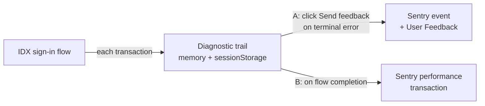

# SIW Gen3 → Sentry POC

A gen3-only, opt-in exploration of sending sign-in diagnostics to Sentry. This doc is a
demo/explainer; the deep design + PII writeup lives in
[`terminal-feedback-diagnostics.md`](./terminal-feedback-diagnostics.md).

---

## 1. What problem are we solving?

Two gaps in how we understand real sign-ins:

- **Debugging a broken sign-in.** When a user dead-ends, the only faithful record today is a
  **customer-collected HAR file** — slow to obtain, awkward for the user, and full of raw
  secrets (tokens, cookies, credentials). Support/eng often can't see *what the user went
  through* or *where it broke*.
- **Observability / product insight.** There's no easy way to answer aggregate questions from
  real traffic — *how long does sign-in take? how many flows use Okta Verify? where do users
  drop off?*

Both are answered by the same underlying idea: **record each step of the sign-in as it
happens**, then send that trail to Sentry.

---

## 2. Two features

| Feature | Problem it solves | What it does |
|---|---|---|
| **A. Feedback diagnostics** | Debugging one incident (replaces the HAR ask) | On a terminal *error*, a **Send feedback** button ships the flow trail to Sentry as an **event** (context + JSON attachment) plus a linked **User Feedback** entry. One click, PII-safe by default. |
| **B. Performance trace** | Observability across many sign-ins | On **every completed flow**, emit one Sentry **transaction**: total init→finish time + a per-step waterfall, with searchable attributes (flow, authenticator, outcome). |

**A replaces customer HAR collection:**

| | Customer HAR | Feedback diagnostics |
|---|---|---|
| How to get it | user opens DevTools, reproduces, exports, emails | one click on the error screen |
| Contents | raw headers, bodies, cookies, tokens | steps, URLs, statuses, message keys |
| PII / secrets | **high** | **low** (metadata only, by default) |
| Across users | one file per incident | searchable/aggregatable in Sentry |

> Not a byte-faithful HAR (page JS can't capture cross-origin headers/bodies/timings) — it's
> a *logical* record of the flow, which is what "what happened and where did it break"
> actually needs.

**B enables observability**, e.g. "how many flows use Okta Verify?" becomes a Sentry query:
`span.op:"auth.step" has:authenticatorKey → count_unique(trace) grouped by authenticatorKey`.

---

## 3. General tech design

Everything is fed by **one diagnostic trail**. As the user moves through the IDX flow, a
single hook records each transaction; that trail is then sent to Sentry two ways.



How each transaction is tracked (no per-view instrumentation):

```mermaid
sequenceDiagram
  participant U as User
  participant W as Widget
  participant T as Trail
  U->>W: step (introspect / identify / verify / poll)
  W->>W: setIdxTransaction(...)
  W->>T: recordTransaction(step, url, status, authenticator, messages)
  Note over T: polls collapse into one entry; mirrored to sessionStorage;<br/>reset on a fresh flow
```

- The whole flow runs through one state (`idxTransaction`); a single React effect records
  every change, so one hook captures bootstrap, submits, and polls alike.
- A tiny `fetch` tap notes only **URL + method + HTTP status** of each `/idp/idx/*` call.
- The Sentry SDK is **lazy-loaded** (dynamic `import()`), so there's zero cost on the auth
  path until we actually send.
- Trace **B** is rebuilt from the trail's timestamps at completion (root `auth.flow` + a
  child `auth.step` per entry) → ships as **one** transaction.

### What we collect

**Always (metadata — PII-safe):**

- Per step: sequence, timestamp, step/form name, request URL, method, HTTP status, IDX
  status, success flag, message **keys** (not text), authenticator key.
- Per flow: widget version/commit, flow type, final step, terminal error messages,
  environment (user agent, language, platform, viewport), config (issuer origin, client id),
  and the user **identifier** (email/username) if present.
- Trace attributes: `flow`, `authenticatorKey`, `outcome`, `finalStep`, `stepCount`,
  timings.

**Opt-in only (`includeRawResponses` — PII/secret-bearing, POC exploration):**

- The request body per step (may contain credentials / OTP / answers).
- The full raw IDX response (contains `stateHandle`, identifier).

---

## 4. Open questions

- **PII.** The base trail already includes the user identifier, request URLs, and message
  keys. `includeRawResponses` adds credentials/OTP and `stateHandle`. What must be scrubbed
  or dropped before any non-POC use?
- **User consent.** Feature A is explicit (the user clicks *Send feedback*). Feature B
  auto-sends on **every** completed flow — does that need a consent/notice model, or is
  metadata-only acceptable?
- **Data scrubbing.** Sentry redacts fields whose name contains `auth` (e.g.
  `authenticatorKey` → `[Filtered]`). Fix via Safe Fields, renaming, or accept it? This
  affects which observability questions we can answer.
- **Sampling & cost.** The POC traces at 100%. Real traffic needs a `tracesSampler` (low
  success rate, higher for errors) or it will exhaust the Sentry quota.
- **DSN & project.** Where should the DSN live for Okta-hosted pages, and do we want a
  dedicated project vs. separating by `environment` tag?
- **Coverage gaps.** Cross-tab (email magic link) and cross-device (Okta Verify on a phone)
  legs can't be seen client-side; full correlation needs a server-side id
  (`x-okta-request-id`). Also: gen2 parity, and IE11 (Sentry v8 is modern-only).

---

## Appendix — try it locally

```bash
OKTA_SIW_GEN3=true yarn start   # dev server :3000, mock server :3030
```

Enable in `.widgetrc.js` (`feedback: { enabled, sentryDsn, sentryEnvironment: 'dev',
tracePoc, includeRawResponses }`), pick a mock in
`playground/mocks/config/responseConfig.js` (e.g.
`Test.TracePocDemo.oktaVerifyTotpSuccessMock` for a trace, `terminalErrorMock` for feedback),
run the flow, then look in Sentry (filter `environment:dev`): **Traces** (`op:auth.flow`),
**Issues**, **User Feedback**. Example dashboard:
https://okta-prod.sentry.io/dashboard/10087424/

Code: trail `feedbackDiagnostics.ts`, senders `sentryFeedback.ts` / `sentryTracePoc.ts`,
wiring `components/Widget/index.tsx`, demo mocks `test-configs/TracePocDemo.js`.
