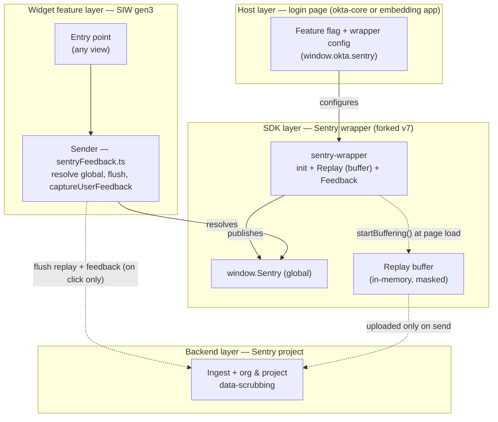

# SIW User Feedback → Sentry — Technical Design

**Status:** Draft · **Epic:** [OKTA-1273163](https://oktainc.atlassian.net/browse/OKTA-1273163) — Sentry improvements: User feedback
**Scope:** gen3 (`src/v3`) only · **Engine for client data:** Sentry **Session Replay** only
**Related tickets:** OKTA-1290948 (widget core), OKTA-1290987 (UI/i18n), OKTA-1290997 (wrapper), OKTA-1291005 (okta-core FF), OKTA-1291007 (playground), OKTA-1292200 (privacy field list)

---

## 1. Summary

Add a user-initiated **"Send feedback"** action to the gen3 Sign-In Widget. A user can click it from
**any** screen; on that click — and only then — a diagnostic snapshot is uploaded to Sentry so support
and engineering can see *what the user went through* and *where it broke*.

The snapshot is produced **entirely by Sentry's Session Replay**, redacted by **Sentry's org-level +
project-level data-scrubbing rules**. The widget does **not** build a custom diagnostic trail, does
**not** emit performance traces/spans, and does **not** bundle or initialize its own Sentry SDK. All
client data comes from Replay; all redaction comes from scrubbing rules.

**Explicitly out of scope:** performance tracing (`auth.flow`/`auth.step` spans), funnels/observability,
any custom per-step event stack. This document is *only* the user-feedback feature.

### Why this shape

| Today | With this feature |
|---|---|
| A dead-ended user's only faithful record is a **customer HAR** — slow, awkward, full of raw secrets. | One click ships a masked session replay + a short comment. |
| Support can't see the screens/clicks that led to the error. | Replay shows the flow; scrubbing guarantees no PII/secrets. |
| No consistent, searchable record across incidents. | Each report is a Sentry **User Feedback** entry, searchable by a fixed tag set. |

---

## 2. Goals / Non-goals

**Goals**
- A "Send feedback" entry point invokable from **any** gen3 view.
- Capture client diagnostics via **Session Replay only**, uploaded **on click** (buffer mode).
- Redaction via **Sentry org + project scrubbing rules** (no bespoke client-side payload scrubbing).
- Consume a **global `window.Sentry`** published by the Sentry wrapper; hard-fail loudly if absent.
- **Off by default**; gated server-side by a feature flag, with an embedded/self-hosted opt-out.
- A short, optional **user comment**.

**Non-goals**
- Performance tracing, spans, funnels, drop-off analytics (separate concern; not this epic).
- A custom diagnostic trail / per-transaction event stack (the POC had one; it is **dropped**).
- Gen2 (Classic/OIE Backbone) parity.
- The consent mechanism itself (output of the privacy review this design feeds).

---

## 3. Data model — Capture + Redact

Two layers, both always on. This is the whole data story: **what Replay captures**, minus **what the
scrubbers remove**.

### 3.1 Capture — Sentry Session Replay

Replay records, into an **in-memory buffer** from page load, two kinds of data, scoped to IDX
endpoints (`/idp/idx/`):

- **User actions** — the DOM/session recording: screens shown, clicks, navigation. On-screen text and
  input values are **masked by Replay itself** (see 3.2).
- **Network data** — the IDX API calls: URL path, method, status, and request/response **bodies**.
  Bodies are captured so we can read the server's error `message`; they are redacted server-side by
  scrubbing (3.2), verified by test.

The buffer **uploads nothing** until the user clicks "Send feedback"; then it flushes once and is
discarded. Sample rates are `replaysSessionSampleRate: 0` / `replaysOnErrorSampleRate: 0` (buffer-only).

Alongside the replay, the feedback entry carries a **fixed, enumerated, low-cardinality tag set** and
the user's typed comment:

| Tag | Example | Notes |
|---|---|---|
| `engine` | `gen3` | constant |
| `siwVersion` | `7.46.0` | build version |
| `flow` | `authenticate` | IDX flow type |
| `formName` | `challenge-authenticator` | current form |
| `factor` | `okta_verify` | authenticator; **named `factor`, not `authenticator*`**, because the org scrubber strips `auth*` fields |
| `hasReplay` | `true` | whether a replay id linked |

### 3.2 Redact — scrubbing rules

**Client-side (Session Replay masking):**
- `maskAllText` — all on-screen text masked
- `maskAllInputs` — all input values masked
- `blockAllMedia` — images / video / canvas blocked

**Server-side (data-scrubbing on ingest), both layers apply:**

| Layer | Rules |
|---|---|
| **Org** (`okta-prod`, all projects) | Require Data Scrubber **ON**, Default Scrubbers **ON**, Prevent Storing IP **ON**, Enhanced Privacy **ON**. Sensitive field names: `username, user, password, email, ip, ip_address, clientIP, activePrincipal`. Strips all email + IP **values** everywhere; filters any `auth*` field. |
| **Project** (adds on top) | Okta-specific names the org list misses: **`identifier`, `stateHandle`**, plus **OTP / passcode / security-answer / token** fields. |

**Net result — removed:** `identifier`, `password`, `stateHandle` (request + response), OTP / passcode /
security answers / tokens / auth codes, all emails, all IPs, and all on-screen text/inputs.

**Net result — kept** (no PII; needed to triage): HTTP path + method + status per step, the response
**`message`** text, the fixed tags above, and the user's comment.

> **Design decision — `networkCaptureBodies` is ON.** We capture replay network bodies (scoped to
> `/idp/idx/`) specifically to retain the server's error `message`, relying on the org + project
> scrubbers to redact sensitive fields. This was **tested and confirmed**: with the shipping config the
> scrubbers apply to replay network bodies — sensitive fields come back `[Filtered]`, so no client-side
> body redaction is needed. (Dependency tickets OKTA-1290997/-1290948 originally said "off"; they are
> being updated to match this decision.)

The full privacy-facing field list is maintained for the privacy review in
**[SIW Send Feedback — Data Captured (Privacy Review)](https://oktainc.atlassian.net/wiki/spaces/eng/pages/1142424984/SIW+Send+Feedback+Data+Captured+Privacy+Review)**
(OKTA-1292200).

---

## 4. Architecture

Layered view — top to bottom is host → shared SDK → widget feature → backend. Solid arrows are
build/wire-time dependencies; the dashed arrow is the one on-click data upload.



### 4.1 Components & ownership

| Piece | Where | Ticket |
|---|---|---|
| Sentry **wrapper** (inits SDK, Replay in buffer mode, publishes `window.Sentry`) | `okta-ui` sentry-wrapper (forked **v7** variant) | OKTA-1290997 |
| Widget **sender** (resolve global, flush replay, `captureUserFeedback`, tags) | `src/v3/src/util/sentryFeedback.ts` | OKTA-1290948 |
| **Entry point** invokable from any view (unstyled trigger via widget context/hook) | gen3 widget | OKTA-1290948 |
| **UI + i18n** (styled button, comment field, status strings) | gen3 + `@okta/i18n` | OKTA-1290987 |
| **Config** (`WidgetOptions.feedback`, off by default + embedded opt-out) | `src/v3/src/types/widget.ts` | OKTA-1290948 |
| **Server gate** (feature flag, wrapper params) | `okta-core` | OKTA-1291005 |
| **Local harness** (playground wrapper + demo) | `playground/` | OKTA-1291007 |

### 4.2 SDK ownership — global `window.Sentry`, no bundled SDK

Production Okta does not let the widget own a Sentry SDK. `@okta/sentry-wrapper` runs `Sentry.init()`
at page load and publishes `window.Sentry`; the widget **reuses that global**. The sender
(`sentryFeedback.ts`) resolves it via a `resolveSentry()` guard and, if the global is absent or
uninitialized, **hard-fails with a loud `console.error`** rather than silently falling back — so a
missing/late wrapper is caught in testing, never masked.

**IE11 constraint →** the SIW must run on IE11; Sentry **v8+ dropped IE11**. The widget's consumption
code therefore targets **v7 APIs** (`getCurrentHub`, `Sentry.Replay`, `startBuffering`,
`captureUserFeedback`). The okta-ui wrapper source has moved to v10 (tracing-only, no Replay, no IE11),
and okta-core currently ships a v7.80 build — hence OKTA-1290997 **forks a v7 wrapper variant** that
adds Replay (buffer) + User Feedback. See that ticket for detail.

---

## 5. Flow

```mermaid
sequenceDiagram
  participant U as User
  participant SIW as Widget (gen3)
  participant Sentry as window.Sentry (wrapper)
  participant BE as Sentry backend

  Note over Sentry: at page load — Replay.startBuffering() (masked, buffer mode)
  U->>SIW: progresses through IDX flow (any screen)
  Note over Sentry: Replay records DOM + /idp/idx/ network into in-memory buffer
  U->>SIW: clicks "Send feedback" (+ optional comment)
  SIW->>Sentry: resolveSentry() → found & initialized?
  alt global present
    SIW->>Sentry: replay.flush() → replayId
    SIW->>Sentry: captureUserFeedback({ comments, tags, replayId })
    Sentry->>BE: upload replay + feedback (scrubbed on ingest)
    SIW-->>U: success state
  else global absent
    SIW-->>U: console.error (hard fail); UI shows failure state
  end
```

**Key properties**
- **On-demand only** — nothing leaves the browser until the click. Buffer is discarded afterward.
- **From any view** — the trigger is a widget-level affordance, not tied to the terminal-error view.
- **Best-effort** — a failed send must never break the sign-in UI.

---

## 6. Configuration & rollout

### 6.1 Widget option (`WidgetOptions.feedback`)

```ts
feedback?: {
  enabled?: boolean;        // show the Send-feedback entry point. DEFAULT: false (off)
  // embedded/self-hosted opt-out knob (exact name TBD in OKTA-1290948)
};
```

- **Off by default.** The feature appears only when enabled.
- **Embedded opt-out** so embedding customers can suppress it even if Okta-hosted turns it on.
- POC-only knobs (`includeRawResponses`, `tracePoc`, `sentryDsn`) are **removed** from the shipped
  surface — the wrapper owns the DSN; there is no custom trail and no tracing.

### 6.2 Server gate (okta-core, OKTA-1291005)

- A **feature flag** (default off) turns `feedback.enabled` on for the Okta-hosted login page; ramp via FF.
- **FF vs. KnownConfig** decision for per-org enablement / embedded opt-out granularity — settled there.
- okta-core ensures the login page loads the **forked v7 wrapper (with Replay + Feedback)** and passes
  Replay config via `window.okta.sentry`, and that the wrapper inits **before** the widget bootstraps.

---

## 7. Privacy & consent

- Sending a session replay off-page is a **consent decision**. The granular field list (what the
  scrubbers keep vs. remove) is maintained for the privacy team in
  **[SIW Send Feedback — Data Captured (Privacy Review)](https://oktainc.atlassian.net/wiki/spaces/eng/pages/1142424984/SIW+Send+Feedback+Data+Captured+Privacy+Review)**
  (OKTA-1292200), pairing with the legal sign-off task **OKTA-1289003**.
- The feature is **user-initiated** (explicit click) and **off by default**, which materially shapes the
  consent posture.
- Confirmations for review: no passwords/OTP/security-answers/tokens/auth-codes; no
  `stateHandle`/identifier/username/email; IPs removed; on-screen text/inputs masked; media blocked;
  tags are a fixed enumerated set (only the user comment is free-form).

---

## 8. Limitations

**Full-page redirects reset the replay buffer.** In buffer mode the recorded content — DOM mutations
and captured network — lives in an **in-memory array** (`@sentry/replay` `EventBufferArray.events`);
only session *metadata* (`id`, `segmentId`, …) is persisted to `sessionStorage`. A full-page navigation
tears down the JS context and discards the recorded array, so **anything recorded before a redirect is
lost** — the uploaded replay covers only from the post-redirect page load up to the click.

- **In-page steps are fine.** Most IDX remediations are XHR within one JS context (no navigation), so
  the whole in-page flow is captured.
- **Redirect legs are not.** Social IdP, `/authorize` bounce, and SAML POST full-page navigate. If the
  user clicks "Send feedback" after returning, the pre-redirect leg — often where it broke — is missing.
- **Accepted trade-off.** The POC's custom diagnostic trail mirrored itself to `sessionStorage` to
  survive same-tab redirects; going **replay-only** drops that fallback by design. Cross-tab (email
  magic link) and cross-device (Okta Verify / QR) legs are likewise never in the client replay — those
  need server-side correlation (out of scope).

---

## Appendix — relationship to the POC

The branch `gen3-terminal-sentry-feedback` prototyped more than this feature: a custom diagnostic trail
(`feedbackDiagnostics.ts`), `includeRawResponses`, and a performance-trace POC (`sentryTracePoc.ts` with
`auth.flow`/`auth.step` spans + dashboards). **This design keeps none of those.** Client data is Session
Replay only; redaction is scrubbing rules only; tracing/observability is out of scope. The POC is
reference for the Replay + wrapper + sender wiring, not a diff to ship.
